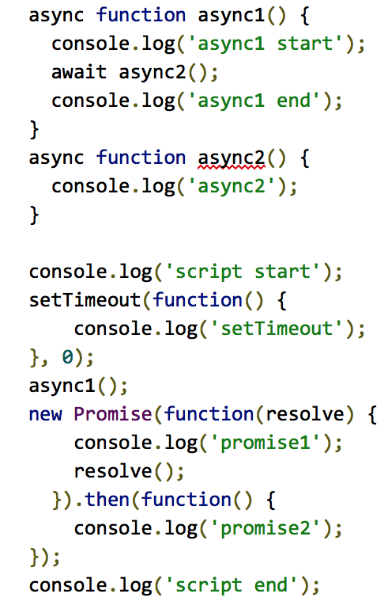
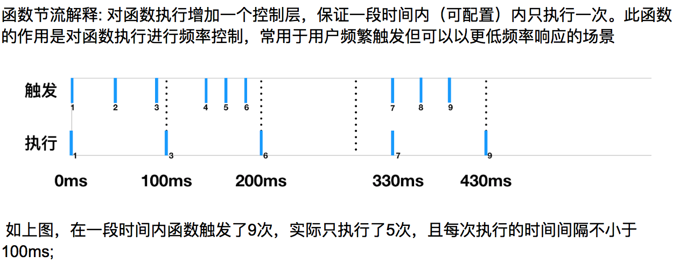

- 使用`new`操作符时发生了什么？
- 以下代码的执行结果是什么？

  

- 观察者模式是什么？请简单的实现一个Event类，继承自此类的对象都会拥有四个方法`on`, `off`, `once`, `trigger`，其中`on`用于绑定事件，`trigger`用于触发事件，`off`用于卸载事件，`once`事件只触发器一次

- 

- 在触发绑定的事件时，比如
  
  ```javascript
  dom.addEventListener('click', function(e) {
    // Your Code
  })
  ```

  第二个参数，即函数里面有一个事件对象`e`，在`e`中有`target`和`currentTarget`，谈谈两者的区别

- 一个div，水平垂直居中，不少于三种方式
- MVC是什么？MVVM是什么？MVC和MVVM的区别？